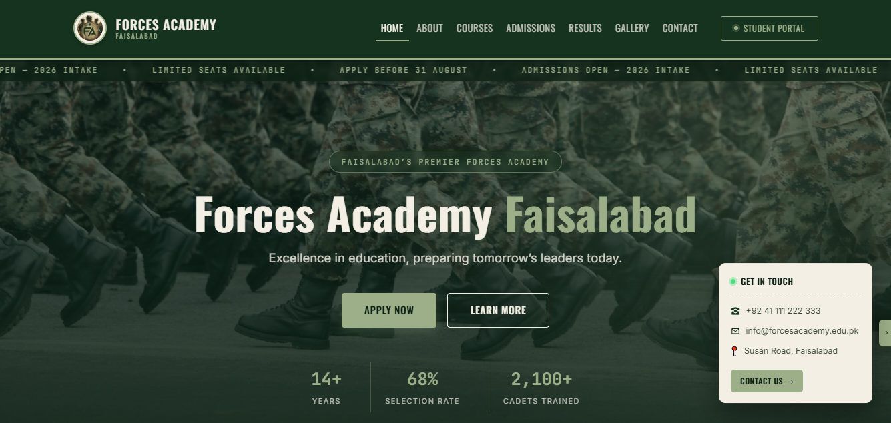
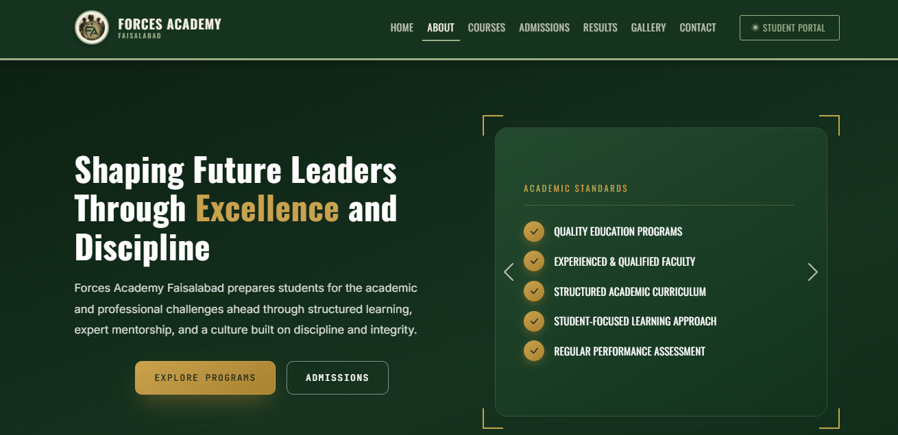
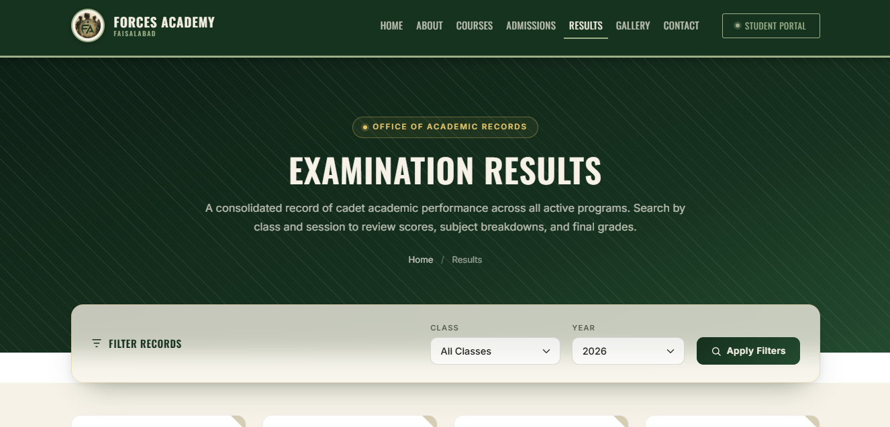
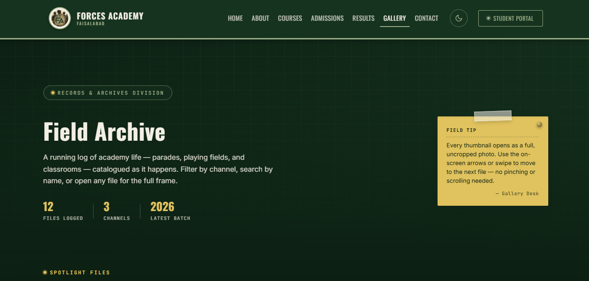

# 🎖️ Forces Academy Faisalabad — Official Website

**Forces Academy Faisalabad** is a premier military preparatory institute dedicated to shaping disciplined, high-achieving students for careers in the armed forces and top academic programs. The academy offers focused coaching for **FSc Pre-Medical, FSc Pre-Engineering, ICS, Matric Science, Matric Arts**, and specialized **Entry Test / ISSB Preparation**, combining rigorous academics with the physical training, discipline, and mentorship required to succeed in defence-forces selection processes.

🔗 **Live Site:** https://hamna6.github.io/forces-academy-frontend-codesaviours-si26-hamna/

---

## 📸 Screenshots

| Home Page | About Page | Results Page | Gallery Page |
|---|---|---|---|
|  |  |  |  |

---

## 🛠️ Tech Stack

- **HTML5** — semantic, multi-page structure
- **CSS3** — custom design system, dedicated stylesheets (`home.css`, `about.css`, `contact.css`, `gallery.css`, `results.css`) plus shared `style.css` for common tokens and layout
- **Bootstrap 5** — grid, carousel, and responsive components
- **JavaScript (Vanilla)** — interactivity, filters, sliders, scroll effects
- **GLightbox** — image lightbox for the gallery
- **Google Fonts** — Oswald (headings), Inter (body), JetBrains Mono (accents)

---

## ✨ Features

- *Multi-page architecture* — a full seven-page layout spanning Home, About, Courses, Admissions, Results, Gallery, and Contact
- *Responsive across all devices* — Bootstrap 5's grid system ensures the layout adapts cleanly from mobile to desktop
- *Mobile-friendly navbar* — collapsible two-tier navigation for smooth movement between all seven pages
- *Home page* — hero banner, animated stats, and a testimonials slider introducing the academy
- *About page* — mission, vision, and leadership team details for the institution
- *Courses page* — showcases the academy's academic programs in a structured, card-based layout
- *Admissions page* — walks prospective students through requirements, the application process, and fee details
- *Results page* — presents student academic results in a searchable, color-coded table format
- *Gallery page* — visual showcase of academy events, facilities, and campus life
- *Contact page* — inquiry form alongside the academy's location and contact information
- *Semantic, accessible markup* — clean HTML5 structure throughout the site
- *Cross-browser support* — consistent rendering across Chrome, Firefox, and Edge

---

## 🚀 How to Run Locally

1. **Clone the repository**
   ```bash
   git clone https://github.com/hamna6/forces-academy-frontend-codesaviours-si26-hamna.git
   ```

2. **Navigate into the project folder**
   ```bash
   cd forces-academy-frontend-codesaviours-si26-hamna
   ```

3. **Open the site**
   - Double-click `index.html` to open it directly in your browser, **or**
   - Use **VS Code Live Server** (recommended): install the *Live Server* extension → right-click `index.html` → **Open with Live Server**

4. **Browse the site** — use the navbar to move between Home, About, Courses, Admissions, Results, Gallery, and Contact.

---

## 👤 Built By

**Hamna Rizwan** | Code Saviours SI-26 | 2026